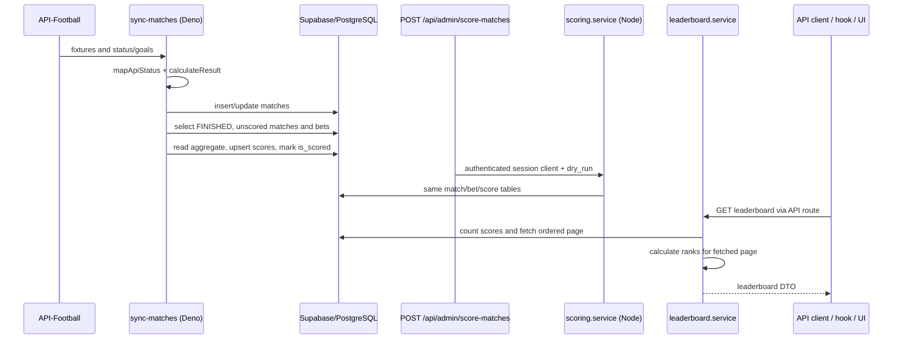

# Research: Finished match to tournament leaderboard scoring flow

The goal is to document the current path from `sync-matches` and the manual scoring
endpoint to the leaderboard, because the refreshed project map identified this split
Node/Deno flow as the highest-risk runtime boundary.

**Date**: 2026-09-14T14:58:20+02:00

**Researcher**: Jarosław Latek

**Git Commit**: `c323606243a04008a0a925ff2335d5a496af6dd1`

**Branch**: `10xArchitect_cert`

**Repository**: `betMate`

## Research Question

How does betMate currently move a finished match through result derivation and point
calculation into the tournament leaderboard, which parts are covered by tests, and
what is the real blast radius of changing this flow?

## Summary

There are two production scoring orchestrations. The Deno Edge Function imports match
data, derives a `HOME_WIN`/`DRAW`/`AWAY_WIN` result, persists the match and then scores
it with a service-role client. A second Node/Astro path exposes
`POST /api/admin/score-matches` and runs a separate scoring service with the current
user's session client. The two paths share the three-point constant, but not the
comparison, persistence, error handling or idempotency logic.

Both implementations select unfinished scoring work, read each user's aggregate,
compute a new total, UPSERT it, and only then set `matches.is_scored=true`. These are
separate database calls. This proves that the flow is not expressed as one repository
transaction; duplicate points, lost updates and partial completion are risks inferred
from retry and concurrency interleavings, not failures reproduced against a real DB in
this research.

The Node scoring service and pure rule have strong unit coverage (23 tests; all lines,
with the service at 88% branch coverage), but the Edge ingestion/scoring path and the
leaderboard service/API/client/hook/components have no direct tests. Current E2E tests
do not assert awarded points or rank. The leaderboard also assigns ranks after applying
database pagination, so page two starts its local calculation at rank one and cannot
preserve a tie crossing the page boundary.

## Feature overview

### End-to-end runtime path

### 1. Match ingestion and result derivation

- **Evidence:** `mapApiStatus` maps API-Football short statuses into five database
  states; unknown values fall back to `SCHEDULED`
  (`supabase/functions/sync-matches/index.ts:28-61`).
- **Evidence:** `calculateResult` returns `null` if either goal value is missing,
  otherwise derives the three 1X2 outcomes (`index.ts:63-71`).
- **Evidence:** full sync persists status, result and scoreline for new fixtures
  (`index.ts:300-376`); live sync refreshes candidates and updates the same fields
  (`index.ts:400-485`).
- **Evidence:** after either sync mode, the handler invokes scoring
  (`index.ts:492-537`).
- **Unknown:** the deployed scheduler, Edge gateway settings, secrets, deployed
  migration level and production API-Football payload are not represented in this
  repository and were not queried.

### 2. Automatic Edge scoring

- **Evidence:** the Edge path uses a Supabase client created from the service-role key
  (`index.ts:492-528`).
- **Evidence:** it selects matches where status is `FINISHED`, `is_scored` is false and
  result is not null (`index.ts:165-187`), then selects every bet for each match
  (`index.ts:191-204`).
- **Evidence:** a correct bet is checked by direct equality. The path reads the current
  aggregate, adds `POINTS_FOR_CORRECT_BET`, and UPSERTs on
  `(user_id,tournament_id)` (`index.ts:206-237`).
- **Evidence:** it marks the match scored after processing bets
  (`index.ts:239-247`). An UPSERT error increments the error counter but does not stop
  that final mark.

### 3. Manual Node/Astro scoring

- **Evidence:** `POST /api/admin/score-matches` requires authentication and accepts a
  `dry_run` flag, but contains no admin-role check
  (`src/pages/api/admin/score-matches.ts:7-52`).
- **Evidence:** the route passes `locals.supabase` to `scoreMatches`; middleware builds
  this request client from the user session (`src/middleware/index.ts:5-14`,
  `src/db/supabase.server.ts:34-47`).
- **Evidence:** the service applies the same match filter, direct outcome comparison,
  read-add-UPSERT sequence and final match flag as the Edge path
  (`src/lib/services/scoring.service.ts:21-93,100-145`).
- **Evidence:** repository migrations allow authenticated users to read all matches,
  only their own bets and all scores, while match/score mutation is reserved for the
  service role (`supabase/migrations/20251028120000_initial_schema.sql:213-244,298-313`).
- **Inference:** if production RLS matches these migrations and the request client has
  the authenticated role, manual scoring cannot read other users' bets or write scores
  and match flags correctly. This requires an integration check against the actually
  deployed policies and key configuration before it can be called a runtime fact.

### 4. Shared rule and data contracts

- **Evidence:** `score-rule.ts` declares three points and a pure `pointsForBet` oracle
  (`src/lib/scoring/score-rule.ts:21-35`). Both runtimes import the constant, but neither
  calls the function in production.
- **Evidence:** both runtimes communicate through `matches`, `bets` and the
  denormalized `scores` aggregate rather than through a shared orchestration.
- **Evidence:** `scores` has a composite primary key and non-negative points constraint
  (`initial_schema.sql:142-167`); `bets` has one row per user/match and uses the same
  `match_outcome` vocabulary (`initial_schema.sql:111-140`).
- **Evidence:** outcome vocabulary is repeated in the generated DB type, shared app
  types, Edge-local types, scoring rule type and bet validation
  (`src/db/database.types.ts:208-216`, `src/types.ts:47-55`,
  `sync-matches/index.ts:28-30`, `score-rule.ts:21-22`,
  `src/lib/validation/bet.validation.ts:11-13,29-31`).
- **Inference:** changing the numeric points constant reaches both runtimes. Changing
  only `pointsForBet` changes tests but not production behavior today.

### 5. Leaderboard read path

- **Evidence:** the authenticated leaderboard endpoint validates tournament ID,
  pagination and delegates to `getLeaderboard`
  (`src/pages/api/tournaments/[tournament_id]/leaderboard.ts:8-90`).
- **Evidence:** the service verifies the tournament, counts score rows, fetches one page
  ordered by points and user ID, then calls `calculateRanks`
  (`src/lib/services/leaderboard.service.ts:9-35,42-65,72-124`).
- **Evidence:** the response travels through `leaderboard.api.ts`,
  `useLeaderboard.ts`, `LeaderboardView.tsx`, `LeaderboardTable.tsx`,
  `LeaderboardRow.tsx` and `StickyUserRow.tsx`.
- **Evidence:** only users represented by a `scores` row are counted. Both scoring paths
  create/update a score row only for a correct prediction.
- **Inference:** a user with only wrong predictions is absent rather than displayed
  with zero points. Whether that is intended product behavior is unknown.
- **Evidence:** the hook derives the current user's sticky entry only from entries
  already loaded in the browser (`src/components/hooks/useLeaderboard.ts:40-43`).

## Test coverage

### Existing signal

- **Evidence:** the current unit suite passes 49/49 tests in three files. Of these,
  4 cover `score-rule.ts` and 19 cover `scoring.service.ts`.
- **Evidence:** `score-rule.ts` has complete line and branch coverage. The Node scoring
  service has complete line/function/statement coverage and 88% branch coverage; its
  uncovered fallbacks are at lines 33, 46 and 140.
- **Evidence:** Node tests cover happy paths, dry run, wrong bets, existing totals,
  multiple matches and several Supabase errors
  (`src/lib/services/scoring.service.test.ts:32-856`).
- **Evidence:** the pure rule test checks correct, wrong, null and the literal value
  three (`src/lib/scoring/score-rule.test.ts:9-32`).

### Missing or misleading signal

- **Evidence:** there is no direct test importing or naming the Edge mapping,
  synchronization or scoring functions.
- **Evidence:** no direct unit/integration tests cover `leaderboard.service`, its route,
  browser API client, hook or React components.
- **Evidence:** the leaderboard E2E suite says detailed cases were removed and several
  tests pass without an assertion when the target state does not occur
  (`tests/e2e/specs/leaderboard.spec.ts:9-10,26-27,41-54,68-80`).
- **Evidence:** no test executes a successful award followed by a failed match mark and
  a retry. No test runs the two scoring entry points concurrently against PostgreSQL.
- **Unknown:** E2E was not run because its global setup writes Supabase data. Its result
  and the state of its configured environment are outside this read-only analysis.

## Technical debt

### TD1 — duplicated scoring orchestration

**Evidence:** Node (`scoring.service.ts:21-145`) and Deno
(`sync-matches/index.ts:165-255`) independently implement selection, comparison,
accumulation, persistence, error handling and final marking. Only the points constant is
shared. Git history supports this coupling: commit `2956e01` changed the rule, its test
and both runtimes together.

**Impact:** a behavioral change must be checked in two runtime environments and can
silently diverge even while the pure rule test stays green.

### TD2 — non-atomic read/add/write and award-before-flag

**Evidence:** both paths read the aggregate and later UPSERT a computed total; score
writes occur before the separate `is_scored=true` update. Neither path calls a database
RPC in these implementations.

**Inference:** concurrent runs can both observe the same work and existing total,
causing duplicate awards or a lost update. A retry after a successful award and failed
flag can award again. These interleavings were not reproduced in a real database here.

### TD3 — Edge partial-failure semantics

**Evidence:** the Edge loop continues after an individual score UPSERT fails and then
marks the match scored (`sync-matches/index.ts:219-247`).

**Inference:** the missing award can become permanently skipped because the match no
longer qualifies for scoring.

### TD4 — manual endpoint authority mismatch

**Evidence:** the endpoint name says `admin`, but code checks only for any authenticated
user. The supplied session client conflicts with repository RLS needed for all-bet read
and score/match writes.

**Inference:** under the checked-in policies, the endpoint is both broadly triggerable
and unable to perform the intended privileged operation completely. Actual deployed
behavior remains unknown.

### TD5 — ranking after pagination

**Evidence:** `.range(offset, offset + limit - 1)` runs before
`calculateRanks(entries)`, whose rank starts at one
(`leaderboard.service.ts:42-65,88-109`).

**Inference:** later pages reset rank to one, and a tie split across pages cannot retain
the rank established on the preceding page.

### TD6 — incomplete participant model

**Evidence:** participant count and rows come only from `scores`, and score records are
written only for correct bets.

**Inference:** bettors with zero correct predictions are not leaderboard participants.
The repository contains no confirmed product decision for this behavior.

### TD7 — critical-path test imbalance

**Evidence:** Node orchestration is thoroughly mock-tested, while the production Edge
path, database policies, concurrency/retry behavior and rank pagination have no direct
executable coverage. Existing leaderboard E2E does not validate points or positions.

**Impact:** the strongest tests exercise the less privileged and possibly RLS-blocked
scoring path, while the service-role production path remains unprotected.

## Blast radius

| Change axis              | Areas that participate in the current contract                                                                                                          |
| ------------------------ | ------------------------------------------------------------------------------------------------------------------------------------------------------- |
| Result derivation        | Edge status/result mapping; `matches` and `bets` enums; generated DB types; shared app types; bet validation and presentation; both scoring comparisons |
| Points rule              | `score-rule.ts`; its unit test; Node scoring; Edge scoring; scoring tests; leaderboard meaning                                                          |
| Idempotency/accumulation | both scoring paths; `matches.is_scored`; `scores` PK/constraints; RLS/service role; retry and concurrency behavior; DB types if schema changes          |
| Leaderboard/ranking      | `scores`/`profiles` relation; leaderboard service; route and validation; DTOs; browser API; hook; React UI; pagination, ties and zero-point semantics   |

Dependency-cruiser reports 78 modules, 190 dependencies and zero configured
violations. Its direct graph correctly connects each runtime to the shared constant and
the leaderboard route to its service, but it cannot represent table/RLS/HTTP/cron edges
or `.astro` composition. The database contract above is therefore part of the blast
radius even without import edges.

## Structural claim verification

The report's structural claims were checked with `ast-grep 0.45.3`. Every zero-result
query was repeated with `rg`, as required by M4L3.

| Initial claim                                                     | Result    | Mechanical verification                                                                                       |
| ----------------------------------------------------------------- | --------- | ------------------------------------------------------------------------------------------------------------- |
| Correct-bet equality exists in both scoring runtimes              | Confirmed | Pattern `bet.picked_result === match.result` found exactly 2 sites: Node line 125 and Edge line 208           |
| Both runtimes UPSERT `scores`                                     | Confirmed | Pattern `supabase.from("scores").upsert(...)` found exactly 2 sites: Node line 68 and Edge line 219           |
| Both runtimes set `matches.is_scored=true`                        | Confirmed | Chained-update pattern found exactly 2 sites: Node line 89 and Edge line 240                                  |
| Production scoring uses shared `pointsForBet`                     | Rejected  | `ast-grep` found 0 calls in the two runtime files; `rg 'pointsForBet\\s*\\('` also found 0                    |
| The two scoring implementations use a DB RPC/transaction boundary | Rejected  | `ast-grep` found 0 `.rpc(...)` calls; `rg '\\.rpc\\s*\\('` also found 0                                       |
| Leaderboard pagination precedes in-memory ranking                 | Confirmed | One `.range(...)` at line 94 and one `calculateRanks(entries)` call at line 109 in lexical execution order    |
| `src/pages/api` contains eight handlers                           | Corrected | AST handler pattern found 9 exports in 8 files; `bets/[id].ts` contains both PUT and DELETE                   |
| Edge scoring/mapping has a direct test                            | Rejected  | Test-file `rg` for `sync-matches`, `scoreFinishedMatches`, `mapApiStatus` and `calculateResult` found 0 files |

## Historical context

- `context/changes/testing-scoring-bet-lock-core/` records the 2026-06 scoring and
  bet-lock testing work. It established three points as the accepted executable oracle.
- Commit `2956e01` changed `score-rule.ts`, its test, Node scoring and Edge scoring
  together, confirming their historical co-change.
- Commit `7844bcb` changed Edge scoring, the leaderboard service and its API route
  together.
- The refreshed `context/map/repo-map.md` supplies the static dependency, Git activity
  and ownership prior used to scope this feature research.

## Evidence, inference and unknowns

### Evidence

- Two production scoring implementations exist and share only the points constant.
- Both communicate primarily through three database tables rather than imports.
- Each performs read-add-UPSERT before separately marking the match scored.
- Edge runs with service-role credentials; the manual route uses a session client.
- Ranking is calculated after database pagination.
- Tests are concentrated in the Node implementation and pure rule.

### Inference

- Retry/concurrency can duplicate awards or lose updates.
- Edge can permanently omit a failed award after marking the match scored.
- Manual scoring is incompatible with the checked-in RLS when invoked as an ordinary
  authenticated user.
- Later leaderboard pages and cross-page ties receive incorrect ranks.
- Users with only wrong predictions are absent from the leaderboard.

### Unknown

- Deployed migrations, RLS policies, secrets and exact PostgREST role behavior.
- Edge deployment/gateway and external scheduling configuration.
- Live API-Football payload behavior for unusual or corrected match statuses.
- Desired behavior when a provider corrects a result after scoring.
- Whether zero-point bettors should be visible.
- Actual effects of retries and parallel Edge/manual runs against PostgreSQL.

## Open questions for the decision gate

1. Is the analyzed feature boundary — finished match through score persistence to the
   displayed leaderboard — the intended M4L3 target?
2. Should the manual `/api/admin/score-matches` path be treated as supported production
   behavior or as an obsolete/diagnostic path?
3. Should users with bets but zero correct predictions appear in the leaderboard?
4. Is the accepted current points oracle still three points for any correct 1X2 result,
   despite the one-point statement in `.ai/prd.md`?

No refactor design or implementation is included. M4L3 stops here for user confirmation.
