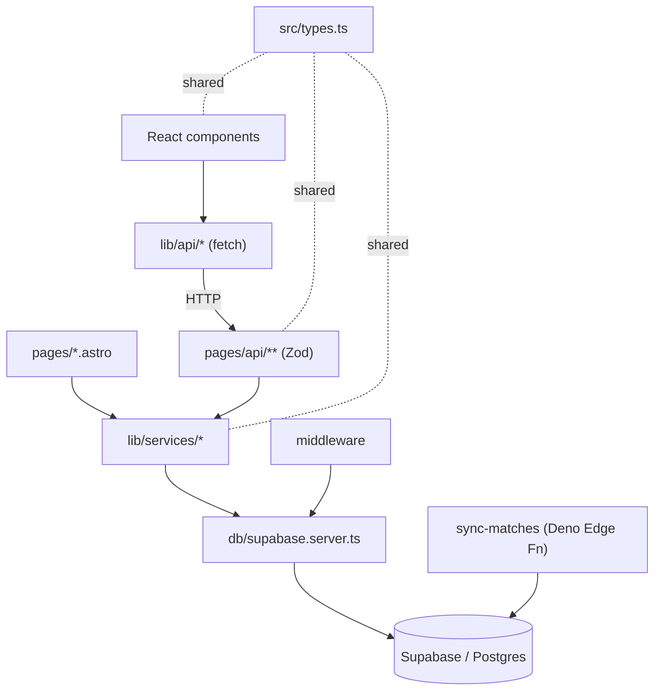

# Artifact 2 — Structure (dependency / layering)

Method: static import analysis over `@/*` aliases (betMate is a small Astro+React app, not a monorepo, so the course's `dependency-cruiser` monorepo prompts were adapted to the real layout). Full `dependency-cruiser` run noted as optional next step below.

## Key observations

1. **Clean layered architecture, no back-edges.** `lib/*` never imports `components/*` or `pages/*` (verified). Server and client paths are properly separated.
2. **Two parallel paths split by Supabase client** — the central architectural rule. Server code goes through `db/supabase.server.ts`; React goes through `lib/api/*` → HTTP → endpoints → `db/supabase.server.ts`. The browser never touches services or the DB directly.
3. **`src/types.ts` is the universal connector** — imported by api (5×), services (7×), components (5×). The shared vocabulary; the one file every layer depends on.
4. **No dependency cycles found** in the layered graph (acyclic: pages → services → db; components → lib/api → endpoints).
5. **`sync-matches` Edge Function is an isolated subsystem** (Deno runtime, own import map) — writes the DB but shares no code with the app. Its only contract with the app is the database schema.

## Layer map

| Layer | Path | Imports (allowed) | Notes |
|-------|------|-------------------|-------|
| Routes (server) | `src/pages/*.astro`, `src/pages/api/**` | services, validation, types, utils | Zod-validated; `prerender = false` |
| Services (server) | `src/lib/services/**` | `db/database.types`, types, validation | business logic; hits Supabase server client |
| DB | `src/db/**` | — | `supabase.server.ts` (SSR), `supabase.browser.ts` (client), `database.types.ts` |
| Client API | `src/lib/api/**` | types | browser `fetch` wrappers → endpoints |
| Components (client) | `src/components/**` | `lib/api`, `lib/utils`, `components/ui`, `hooks`, types | React; never imports services/db |
| Shared | `src/types.ts`, `src/lib/validation/**`, `src/lib/utils/**` | — | cross-cutting |
| Middleware | `src/middleware/index.ts` | db (server) | session on every request |
| Ingestion | `supabase/functions/sync-matches` | (Deno, isolated) | separate runtime |



## Endpoint inventory (verified against `src/pages/api/`)

| Endpoint | Methods present | Status vs. roadmap |
|----------|-----------------|--------------------|
| `/api/bets` | POST | done |
| `/api/bets/[id]` | **PUT, DELETE** | ✅ `DELETE` (was listed as remaining phase-4) is **already implemented** |
| `/api/matches` | GET (collection) | done |
| `/api/matches/[id]` | — | ❌ **missing** (phase-4 `GET /api/matches/:id` not built) |
| `/api/me/bets` | GET | done |
| `/api/me/profile` | — | ❌ **missing** (profile feature) |
| `/api/profiles/[username]` | — | ❌ **missing** (profile feature) |
| `/api/tournaments` | GET | done |
| `/api/tournaments/[tournament_id]/leaderboard` | GET | done |
| `/api/auth/check-username` | — | done |
| `/api/admin/score-matches` | — | scoring trigger |

**Map correction to project memory:** `DELETE /api/bets/:id` is **done**, not remaining. The real gaps are the **profile endpoints** and **`GET /api/matches/:id`**.

## Testability risks

- **Services are the testable core** and already have tests (`bet.service.test.ts`, `scoring.service.test.ts`) — they depend only on db types + validation, so they mock cleanly. Good.
- **`scoring.service`** is the highest-stakes untested-path risk for live use: it computes points; a bug silently corrupts the leaderboard during the tournament. Strong unit + integration coverage warranted.
- **`sync-matches`** can only be meaningfully tested against a live/staged api-football response + DB → integration/e2e territory, not unit.
- **Middleware/session** spreads across every authed route → e2e is the natural guard (already covered by the Playwright suite).

## Optional next step: real graph

To confirm the no-cycles claim mechanically and render a focused SVG:
```
npx depcruise src --include-only "^src" --output-type dot | dot -T svg > context/map/structure.svg
```
Not run here — layering was clear enough from import analysis for a repo this size.

## Limits

Static import view of `@/*` edges only. Does not capture runtime coupling via the database schema (which silently couples `sync-matches`, services, and the scoring function — see artifact 1's "common denominator" note).
