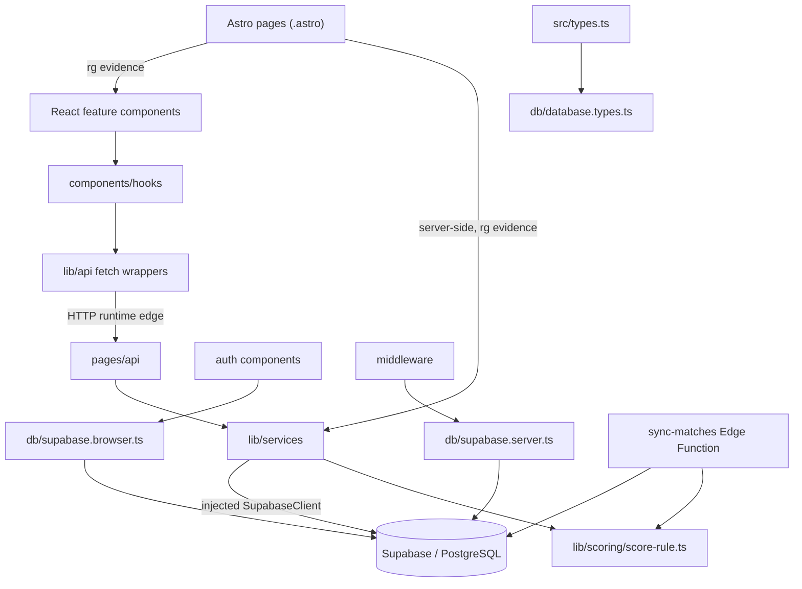

# Artifact 2 — Structure (dependency graph and boundaries)

Analysis date: **2026-09-14**

Baseline commit: `c323606243a04008a0a925ff2335d5a496af6dd1`

## Method

The application graph was generated mechanically with `dependency-cruiser` 18.3.0 on
Node 22.14.0 using `tsconfig.json` path resolution. The reproducible gate is:

```bash
npm run deps:check
```

It analyzes `src` plus `supabase/functions/sync-matches/index.ts`, excludes unit-test
files and external modules, and enforces cycles, resolvable local imports and three
client/server boundary rules from `.dependency-cruiser.cjs`.

Result: **78 modules, 190 dependencies, 0 errors, 0 warnings and no cycles** in the
analyzed TS/TSX graph.

Important limitation: `dependency-cruiser` does not parse `.astro` files. Imports from
Astro pages were therefore verified separately with `rg '^import ' src/pages
src/layouts --glob '*.astro'`. They are evidence from lexical search, not edges from
the dependency graph.

## Architectural shape



There are two deliberate client paths:

1. Match, bet-history and leaderboard React features use hooks and `lib/api` fetch
   wrappers before crossing HTTP into API routes.
2. Authentication components use `db/supabase.browser.ts` directly for Supabase Auth.

This corrects the previous map's over-broad claim that the browser never touches a
Supabase client directly.

## Graph centres and thin entry points

Incoming/outgoing counts below include local graph edges only.

| Module                                           | Incoming | Outgoing | Classification                     | Evidence-backed caution                                       |
| ------------------------------------------------ | -------: | -------: | ---------------------------------- | ------------------------------------------------------------- |
| `src/types.ts`                                   |       29 |        1 | supporting, contract, load-bearing | DTO changes can cross UI, API and services                    |
| `src/lib/utils.ts`                               |       19 |        0 | supporting, shallow, load-bearing  | Styling helper has wide fan-in but little behavior            |
| `src/components/ui/button.tsx`                   |       13 |        1 | peripheral/supporting primitive    | High fan-in is reuse, not business depth                      |
| `src/db/database.types.ts`                       |       10 |        0 | generated contract, load-bearing   | Schema regeneration can affect every typed layer              |
| `src/lib/api/matches.api.ts`                     |        6 |        1 | supporting adapter                 | Shared by match/betting hooks and components                  |
| `src/lib/utils/bet-utils.ts`                     |        5 |        1 | supporting domain-adjacent utility | Status/statistics behavior fans into my-bets UI               |
| `src/lib/services/bet.service.ts`                |        3 |        2 | core, deep                         | Owns create/update/delete/history orchestration               |
| `src/components/leaderboard/LeaderboardView.tsx` |        1 |       10 | UI composition, deep locally       | High outgoing coupling makes isolated UI tests mock-heavy     |
| `src/components/my-bets/MyBetsView.tsx`          |        1 |        9 | UI composition, deep locally       | Composes hooks, types, filters and presentation               |
| `src/components/matches/MatchesView.tsx`         |      0\* |        9 | UI entry/composition               | `0` is an Astro-parser blind spot; `index.astro:4` imports it |

`src/pages/api/**`, `src/middleware/index.ts` and
`supabase/functions/sync-matches/index.ts` have no incoming static edges and are
correctly interpreted as framework/runtime entry points, not dead code. The same
applies to React roots imported only by `.astro` pages.

## Boundary checks

| Boundary                                                                  | Result                 | Evidence                                                        | What it does not prove                                               |
| ------------------------------------------------------------------------- | ---------------------- | --------------------------------------------------------------- | -------------------------------------------------------------------- |
| No import cycles                                                          | Pass                   | `no-circular`, 0 violations                                     | No runtime cycles through HTTP/DB/cron                               |
| Components/API wrappers do not import server services or server DB client | Pass                   | `client-not-to-server`, 0 violations                            | Auth components intentionally use browser client                     |
| Server routes/services/middleware do not import browser DB client         | Pass                   | `server-not-to-browser-db`, 0 violations                        | Correct cookie/session behavior at runtime                           |
| Services do not depend on pages/components                                | Pass                   | `services-not-to-presentation`, 0 violations                    | Quality or transactionality of service logic                         |
| API routes delegate to services                                           | 7 graph edges          | `pages/api → lib/services`                                      | Some routes, e.g. username check, may query directly                 |
| Astro pages compose services/components                                   | Pass by lexical search | `index.astro:3-6`, `my-bets.astro:3-7`, `leaderboard.astro:3-6` | `.astro` edges are absent from graph metrics                         |
| Edge and Node scoring share a module                                      | Pass                   | `scoring.service.ts:4`; `sync-matches/index.ts:17-19`           | Only the points constant is shared; orchestration remains duplicated |

## API and runtime entry points

| Route                                          | Methods     | Downstream            |
| ---------------------------------------------- | ----------- | --------------------- |
| `/api/admin/score-matches`                     | POST        | `scoring.service`     |
| `/api/auth/check-username`                     | POST        | direct Supabase query |
| `/api/bets`                                    | POST        | `bet.service`         |
| `/api/bets/[id]`                               | PUT, DELETE | `bet.service`         |
| `/api/matches`                                 | GET         | `matches.service`     |
| `/api/me/bets`                                 | GET         | `bet.service`         |
| `/api/tournaments`                             | GET         | `tournament.service`  |
| `/api/tournaments/[tournament_id]/leaderboard` | GET         | `leaderboard.service` |

Other runtime entry points are the Astro pages, `src/middleware/index.ts:5`, and the
Supabase Edge Function. `MatchDetailDTO` documents a single-match endpoint
(`src/types.ts:79-94`), but no `/api/matches/[id].ts` entry point exists.

## Structural risks and testability

1. **Scoring has duplicated orchestration across runtimes.** The shared constant is
   real, but result comparison, SELECT-then-UPSERT accumulation and award-then-flag
   sequencing remain duplicated (`scoring.service.ts:52-93,117-136` and
   `sync-matches/index.ts:165-255`). Static coupling is one shared-rule edge;
   database coupling is much wider.
2. **Database schema is a hidden integration contract.** Node services, generated
   types, RLS and the Deno function meet through tables rather than imports. A schema
   change must be traced across migrations, `database.types.ts`, services and Edge.
3. **Astro is a graph blind spot.** React roots appear as zero-incoming modules even
   when pages import them. Do not use orphan metrics alone to delete code.
4. **UI composition has high outgoing coupling.** `MatchesView`, `MyBetsView` and
   `LeaderboardView` naturally pull hooks, adapters and primitives together; behavior
   spanning those seams is better covered by integration/E2E tests than by extensive
   mocking of every child.
5. **Services remain relatively testable.** They receive `SupabaseClient` as an
   argument/constructor and have small local outgoing graphs; deterministic scoring
   and bet rules can be unit-tested, while RLS/transaction guarantees require a real DB.
6. **The scoring admin endpoint is authentication-only.** It checks for a user but no
   admin role (`src/pages/api/admin/score-matches.ts:11-23,50-52`). This is a security
   risk discovered from code, not a dependency violation.

## Unknowns

- HTTP calls, Supabase queries, RLS policies, cron scheduling and external API payloads
  are runtime edges outside the import graph.
- No live/staging call was made, so deployment configuration and API-Football response
  compatibility remain unverified.
- The graph proves current direction of imports, not that the chosen layers are the
  best domain boundaries.
