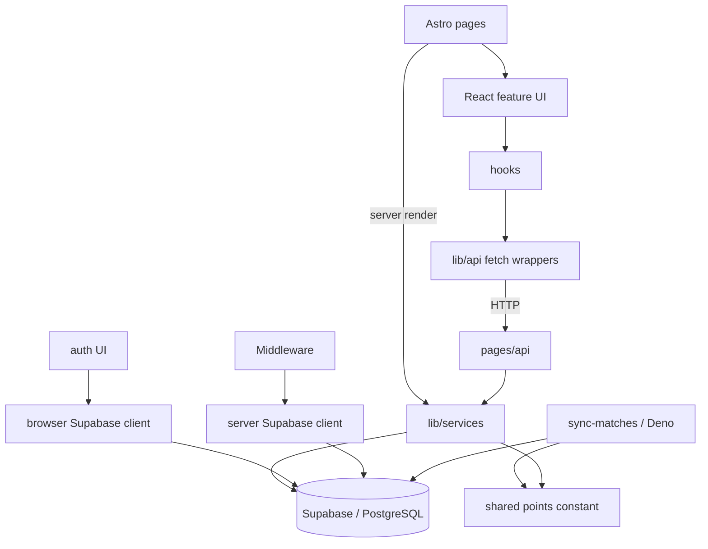

# betMate — Project Map

> Wide Scan refreshed on 2026-09-14 at commit `c323606`. Evidence details:
> `artifact-1-territory.md`, `artifact-2-structure.md`,
> `artifact-3-contributors.md`.

## 1. TL;DR

betMate is a small football-prediction application built with Astro 6.4.8, React 19,
TypeScript, Tailwind and Supabase. Its core user flow is match ingestion → W/D/W bet →
score calculation → tournament leaderboard. The analyzed TS/TSX graph contains 78
modules and 190 dependencies with no cycles or configured layer violations, although
`.astro` composition and database/runtime edges require separate evidence. Development
was seasonal: product work peaked in Q4 2025, E2E/CI dominated Q1 2026, and production
code has barely changed since the scoring extraction in June. The highest-risk path is
split between a Node scoring service and the Deno `sync-matches` function: they share a
points constant but still duplicate non-atomic scoring orchestration. Documentation and
runtime configuration also disagree about the points rule and target tournaments, so
those are decision/operations gaps rather than facts the map can silently resolve.

## 2. Terrain

| Area                                           | Role / depth                      | Change profile             | Why it matters                                                              |
| ---------------------------------------------- | --------------------------------- | -------------------------- | --------------------------------------------------------------------------- |
| `src/lib/services`                             | core, deep                        | seasonal; 8 commit touches | Server business orchestration for bets, matches, scoring and leaderboard    |
| `supabase/functions/sync-matches`              | core, deep, load-bearing          | seasonal; 7 area touches   | Sole external match-data adapter and a production scoring entry point       |
| `supabase/migrations` + `src/db`               | supporting contract, load-bearing | stable after MVP           | Schema, RLS and generated types couple both runtimes invisibly              |
| `src/components/{matches,my-bets,leaderboard}` | core UI, locally deep             | volatile during Q4 build   | Delivers the main user flow; view roots have high outgoing coupling         |
| `src/pages/api`                                | shallow HTTP entry layer          | seasonal                   | Validation/auth boundary delegating mostly to services                      |
| `src/types.ts`                                 | supporting contract, load-bearing | low churn                  | Highest graph fan-in: 29 incoming modules                                   |
| `src/components/ui` + `src/lib/utils.ts`       | peripheral/supporting, shallow    | stable                     | High reuse but little business depth; do not confuse fan-in with core logic |
| `tests/e2e`                                    | test infrastructure               | Q1 campaign                | Broad POM suite, currently not part of the production dependency graph      |

The directory tree overemphasizes UI file count. Operational and correctness risk is
concentrated in the smaller scoring, sync, schema/RLS and session surfaces.

## 3. Real couplings and entry points

- **Graph:** `src/types.ts` has 29 incoming modules and
  `src/db/database.types.ts` has 10. A change to generated schema vocabulary can move
  through API, services and UI even when Git churn is low.
- **Graph:** feature UI follows `components → hooks → lib/api`; API routes have seven
  edges into `lib/services`. Auth is the deliberate exception and imports
  `db/supabase.browser.ts` directly.
- **Graph + code:** Node and Deno scoring both import
  `src/lib/scoring/score-rule.ts`, but only the points constant is shared
  (`scoring.service.ts:4,123-127`; `sync-matches/index.ts:17-19,206-240`).
- **Git:** `components/matches ↔ lib/api`, `services ↔ pages/api`, and
  `components/ui ↔ pages` each co-changed in three commits. These are small-sample
  routing signals, not proof of bad design.
- **Database/runtime, outside graph:** Edge Function, services and leaderboard couple
  through `matches`, `bets`, `scores` and RLS. HTTP fetch calls and cron scheduling are
  likewise invisible to static imports.
- **Lexical verification:** `.astro` pages import React roots and call
  `TournamentService` server-side (`index.astro:3-6`, `my-bets.astro:3-7`,
  `leaderboard.astro:3-6`). Dependency-cruiser cannot see these edges.

Primary entry points are `src/pages/*.astro`, nine HTTP handlers in eight files under
`src/pages/api/**`, `src/middleware/index.ts:5`, and
`supabase/functions/sync-matches/index.ts`.

## 4. Risk zones

| Zone                            | Evidence and caution before change                                                                                                                                                                                                       |
| ------------------------------- | ---------------------------------------------------------------------------------------------------------------------------------------------------------------------------------------------------------------------------------------- |
| Scoring consistency/concurrency | Both runtimes perform SELECT-then-UPSERT and award-before-flag in separate calls (`scoring.service.ts:52-93,117-136`; Edge `:165-255`). Partial or concurrent runs can lose or duplicate points.                                         |
| Match ingestion / external API  | `sync-matches` maps provider statuses and results (`:28-70`) and is the only ingestion adapter. Static analysis cannot validate live API shape, secrets, cron or deploy behavior.                                                        |
| Product/config drift            | PRD/README say World Cup 2026 and one point; code/decision docs use three points, while `TOURNAMENT_IDS` currently lists Champions League and Europa League (`sync-matches/index.ts:21-26`). Requires owner confirmation, not inference. |
| Bet fairness and ownership      | Authoritative five-minute and own-user rules live in RLS (`initial_schema.sql:230-296`); application update/delete checks use a separate JS clock, while create relies on DB enforcement. Verify with a real database before changing.   |
| Scoring trigger authorization   | `/api/admin/score-matches` checks authentication but no admin role (`score-matches.ts:11-23,50-52`). Any authenticated-user trigger is a high-impact surface.                                                                            |
| Shared DB/DTO contract          | `src/types.ts` derives entities/enums from generated DB types (`src/types.ts:1-55`). Migration, type regeneration, services and Edge must be reviewed as one blast radius.                                                               |

## 5. Who to ask

The 12-month window has one human contributor: **Jarosław Latek (Jarek)** authored all
136 human commits. Ask Jarek for every risk zone; Git cannot provide team-level routing.
Use the repository as supporting memory:

- scoring/bet-lock → `context/changes/testing-scoring-bet-lock-core/`
- product behavior → `.ai/prd.md`
- schema/API intent → `.ai/db-plan.md`, `.ai/api-plan.md`
- auth/session → `.ai/auth-spec.md`
- test operations → `tests/e2e/E2E-README.md`, `.github/workflows/`

Where these disagree, record a user decision instead of choosing the newest prose
automatically.

## 6. First day: read in this order

1. `.ai/prd.md` — intended product rules; note known drift before trusting numbers.
2. `src/types.ts` — shared DTO and domain vocabulary with the highest graph fan-in.
3. `supabase/migrations/20251028120000_initial_schema.sql` — tables, constraints and RLS.
4. `src/middleware/index.ts` plus `src/db/supabase.server.ts` and
   `src/db/supabase.browser.ts` — the request/session and two-client split.
5. `supabase/functions/sync-matches/index.ts` — external ingestion and production scoring.
6. `src/lib/services/scoring.service.ts` and `src/lib/scoring/score-rule.ts` — second
   scoring entry and the only shared rule fragment.
7. `src/lib/services/bet.service.ts` — core bet lifecycle and application-side lock.
8. `tests/e2e/specs/betting.spec.ts` plus the three unit suites under `src/lib` —
   executable behavior and current coverage boundary.

## 7. Limits and unknowns

- Activity covers one year and measures touches, not correctness or business value.
- The import graph excludes `.astro`, tests, external packages, SQL behavior, HTTP,
  cron and runtime configuration. Missing graph edges are explicitly not “no coupling”.
- No live Supabase/API-Football request or deployment verification was performed.
- Solo authorship makes contributor mapping a knowledge-concentration warning, not an
  ownership matrix.
- `GET /api/matches/[id]` is described by `MatchDetailDTO` but has no route; profile
  endpoints are also absent. Whether these remain roadmap items is an owner decision.
