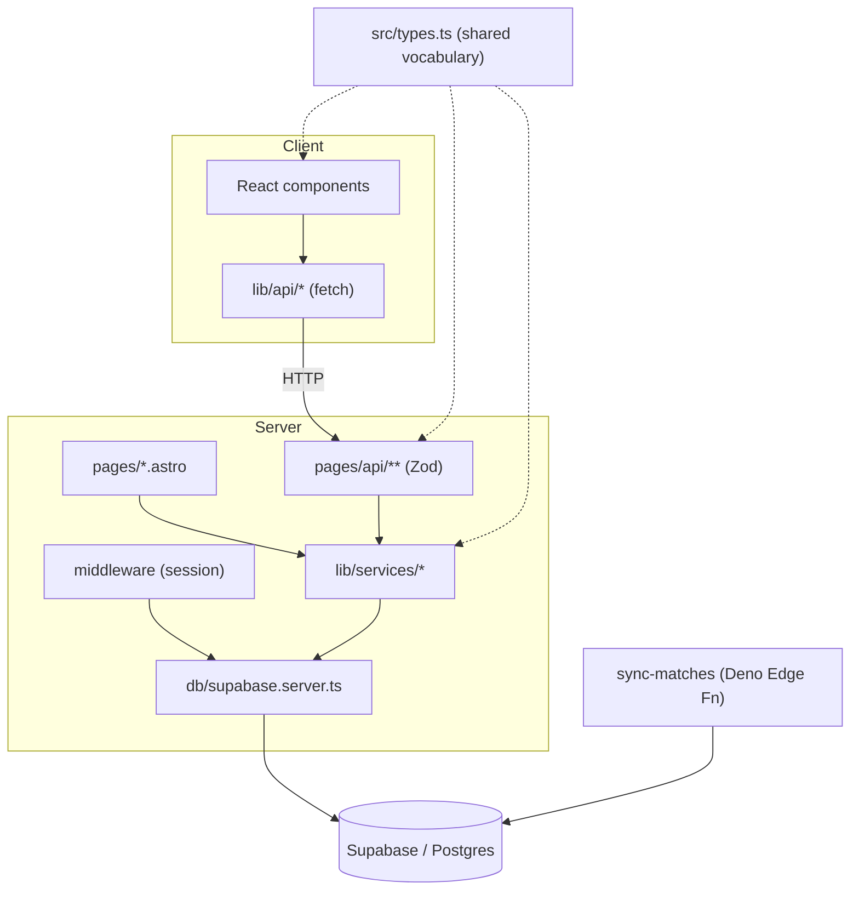

# betMate — Repo Map (onboarding)

> Synthesized from `artifact-1-territory.md` (git history), `artifact-2-structure.md` (layering), `artifact-3-contributors.md` (authorship). Activity/structure window: last 12 months.

## 1. TL;DR

betMate is a football-betting web app (Astro 5 SSR + React 19 + TypeScript + Tailwind 4 + Supabase) where users bet on matches and compete on per-tournament leaderboards. It is a **clean layered system with no dependency cycles**: React components talk to the server only through `lib/api` fetch wrappers → Zod-validated `pages/api/**` endpoints → `lib/services/*` → `src/db` (Supabase). Match data is ingested by a **separate Deno Edge Function `sync-matches`** that shares no code with the app — its only contract is the database schema. Work peaked Oct–Dec 2025 (feature build) and has since shifted to E2E + CI/CD; the repo is in **stabilization**, not active feature growth. It is effectively a **solo project** (Jarek = 130/131 human commits), so knowledge lives in `.ai/` and `.planning/` docs, not in people. The MVP is complete; the remaining work to run live for **FIFA World Cup 2026** is the profile feature, a couple of v1.1 endpoints, dark-mode verification, and production/live-sync ops.

## 2. Territory — where the system lives

**Deep / high-responsibility modules** (hot in git, central in graph):
- `src/components/my-bets` — hottest feature area (betting UI: BetList, BetCard).
- `src/components/matches` — match listing, coupled to `lib/api/matches.api`.
- `src/lib/services` — the business-logic core (bet, scoring, leaderboard, matches, tournament).
- `supabase/functions/sync-matches` — the data spine feeding every feature.
- `tests/e2e/{specs,pages,fixtures}` — cohesive POM suite, the recent focus.

**Shallow / peripheral:** `src/components/ui` (Shadcn primitives — change rarely by intent), `src/layouts`, `lib/utils`.

**Where the directory tree misleads:** the structure looks UI-centric (most files under `components/`), but the **risk and value concentrate server-side** in `lib/services` (esp. scoring) and in `sync-matches` — areas with fewer files but the highest blast radius.

**Activity over time:** Oct–Dec 2025 = feature construction; Jan–Jun 2026 = E2E hardening + CI keep-alive. Feature dev has tapered.

## 3. Real couplings (what actually moves together)

- **`src/types.ts` is the universal connector** (import graph) — every layer depends on it; the safest place to *read*, the riskiest to *break*.
- **`components/matches` ↔ `lib/api`** (git + imports) — match UI and its client API evolve together.
- **auth is cross-cutting** (git): `components/auth` co-changes with `my-bets`, `db`, `pages`, `validation` — session touches many features via `middleware`.
- **E2E suite is self-cohesive** (git): fixtures/pages/specs always change together — expected, low concern.
- **Hidden coupling via the DB schema** (`unknown` to the import graph): `sync-matches`, `lib/services`, and the scoring path are coupled through table shapes, not code. The dependency view cannot see this — treat schema changes as wide-blast.
- **No dependency cycles** detected in the layered graph.

## 4. Risk zones

| Zone | Why it's risky for live World Cup use |
|------|----------------------------------------|
| `lib/services/scoring.service` | Computes points; a silent bug corrupts the leaderboard mid-tournament. Highest-stakes logic. |
| `supabase/functions/sync-matches` | Sole live-data source; if it drifts/fails during matches, the whole app shows stale state. |
| DB schema + migrations | Cross-cuts app + Edge Function via runtime coupling the import graph can't see. |
| `middleware` + auth/session | Spreads across every authed route; a regression locks users out everywhere. |
| `bet.service` + 5-min lock (RLS) | Core fairness rule (no bets <5 min pre-match); enforced in DB — must hold under real load. |
| Production/ops (deploy, cron, env) | Not represented in code yet; the gap between "MVP done" and "runs live during WC2026". |

## 5. Who to ask

Solo repo — **Jarek owns every zone.** There is no routing to do. Substitute for tribal knowledge, per zone:
- scoring / bets → `.ai/post-api-bets-implementation-plan.md`, `.ai/db-plan.md`
- matches / sync → `.ai/get-matches-implementation-plan.md`, `supabase/functions/sync-matches/` + `CLAUDE.md`
- auth → `.ai/auth-spec.md`, `.ai/auth-view-implementation-plan.md`
- leaderboard → `.ai/get-tournaments-id-leaderboard-implementation-plan.md`
- anything → `.ai/prd.md` + `.planning/.statusy-i-podsumowania/`

## 6. First day — read these 5–8 first

1. `CLAUDE.md` — architecture rules of record (client/server split, API conventions).
2. `.ai/prd.md` — product scope and rules.
3. `src/types.ts` — the shared vocabulary every layer uses.
4. `src/middleware/index.ts` — how session/auth gates requests.
5. `src/lib/services/scoring.service.ts` — the highest-stakes logic.
6. `supabase/functions/sync-matches/index.ts` — how live data enters the system (`full` vs `live` modes).
7. `src/db/supabase.server.ts` + `src/db/supabase.browser.ts` — the two-client rule that shapes everything.
8. `tests/e2e/specs/betting.spec.ts` — the betting happy-path as executable spec.

## 7. Limitations

- Activity/structure reflect a **12-month window** — this is *where work happened* and *how code is wired*, not a correctness audit.
- **Solo authorship**: git ownership carries no division-of-labor signal; contributor mapping is N/A.
- Static import analysis only — **runtime coupling through the database schema is `unknown` to the graph** and called out explicitly above (not "no coupling").
- `dependency-cruiser` was not run mechanically; the no-cycles claim is from import analysis of a small repo. Command to verify is in `artifact-2-structure.md`.
- **Roadmap correction discovered while mapping:** `DELETE /api/bets/:id` is already implemented (project memory listed it as remaining). Real remaining gaps: profile endpoints (`/api/me/profile`, `/api/profiles/:username`), `GET /api/matches/:id`, dark-mode verification, and production/live-sync ops.
